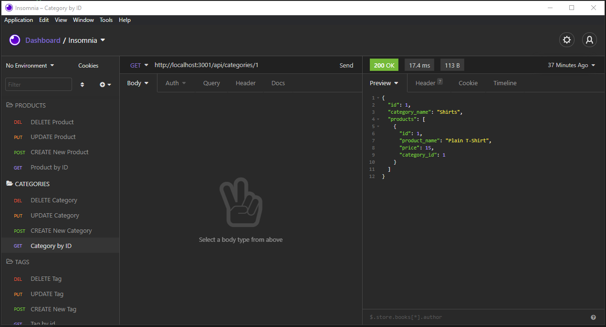

# 13 Object-Relational Mapping (ORM): E-Commerce Back End

## Description
This is an e-commerce database application using express.js and sequelize for interacting with a MySQL database

## Technologies used
- Express.js 
- Sequelize
- MySQL
- Insomnia
- Node.js

## Usage 
`npm i `  
`npm run seed`  
`npm run start`  
Test with Insomnia or similar program

## Link to Demonstration
https://youtu.be/80HofkmxXso

## Screenshot
